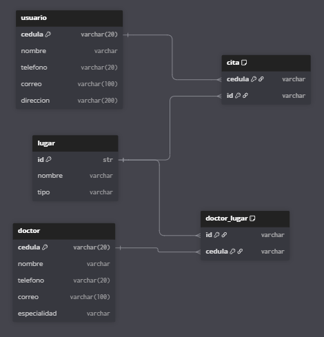
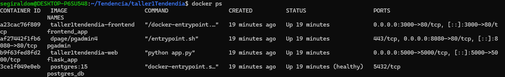
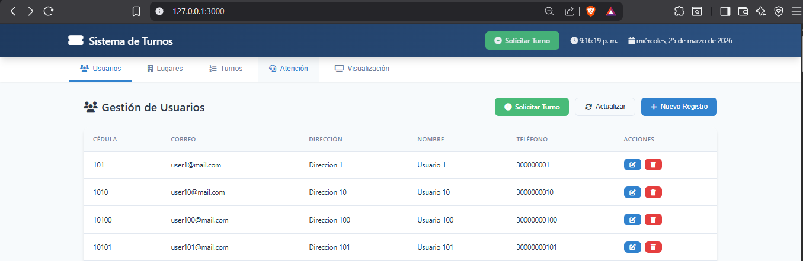
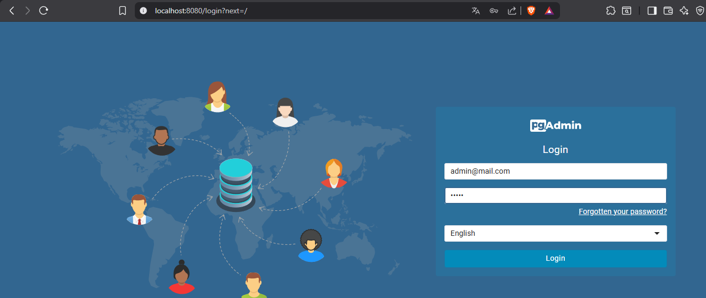
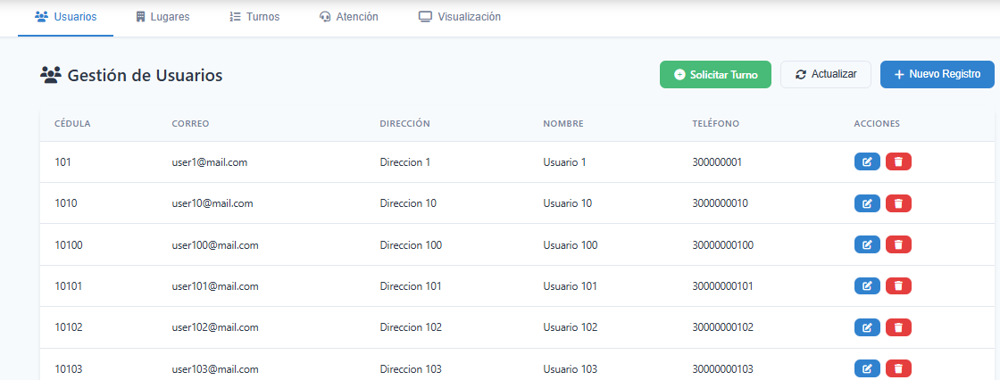
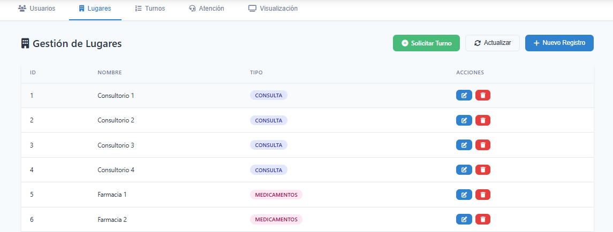
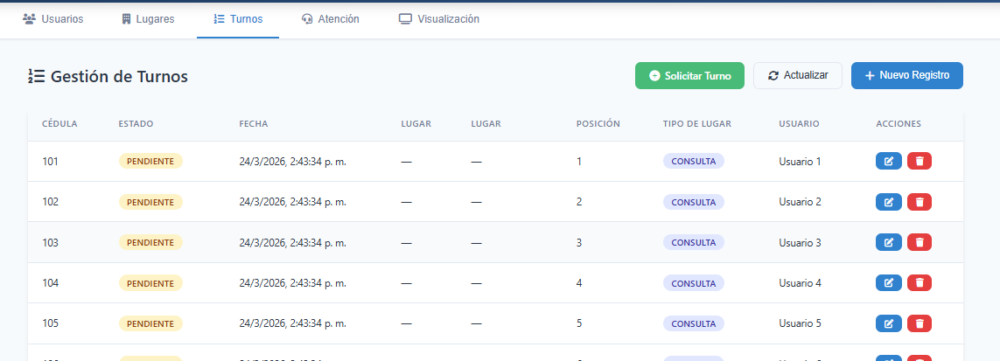
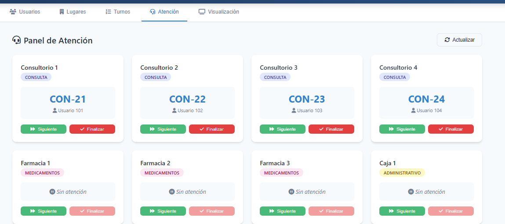
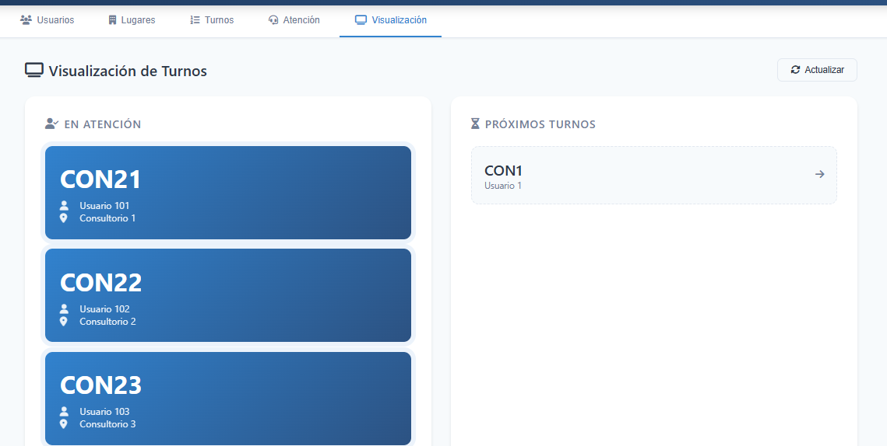
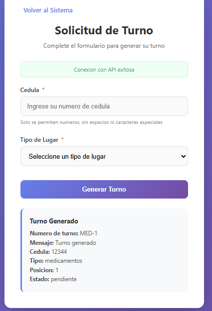

# Sistema de Turnos

Sistema de gestión de turnos diseñado para centros de atención como clínicas, hospitales u oficinas de servicio. Permite administrar usuarios, lugares de atención y el flujo completo de turnos con visualización en tiempo real.



## Arquitectura del Proyecto

El proyecto está construido con una arquitectura de tres capas que se comunican entre sí:

**Capa de Presentación (Frontend)**
- Archivo HTML estático con CSS y JavaScript
- Servido mediante contenedor Nginx en http://localhost:3000
- Se conecta a la API mediante peticiones HTTP (fetch)

**Capa de Negocio (Backend)**
- API REST construida con Flask (Python)
- Expone endpoints para operaciones CRUD
- Implementa la lógica de negocio para gestión de turnos
- Habilita CORS para permitir conexión desde el frontend local

**Capa de Datos (Base de Datos)**
- PostgreSQL 15 como sistema de base de datos relacional
- Almacena información de usuarios, lugares y turnos
- Ejecutado en contenedor Docker aislado

**Infraestructura**
- Docker Compose para orquestación de servicios
- Cuatro contenedores: PostgreSQL, Flask, pgAdmin y Frontend (Nginx)
- Red interna para comunicación entre servicios
- Volúmenes persistentes para datos de la base de datos

## Tecnologías Utilizadas

**Backend:**
- Python 3.11
- Flask 3.x (framework web)
- psycopg2-binary (conector PostgreSQL)
- flask-cors (manejo de CORS)

**Base de Datos:**
- PostgreSQL 15
- pgAdmin 4 (herramienta de administración)

**Frontend:**
- HTML5
- CSS3 (con variables CSS y Flexbox/Grid)
- JavaScript vanilla (ES6+)
- Font Awesome 6.4 (iconografía)

**Infraestructura:**
- Docker y Docker Compose
- Contenedores con health checks
- Redes internas de Docker

## Estructura del Proyecto

```
taller1Tendendia/
├── app/
│   ├── app.py                 # Aplicación Flask con endpoints de la API
│   ├── Dockerfile             # Definición de imagen para el backend
│   ├── requirements.txt       # Dependencias de Python
│   └── init-db/
│       └── 01-init.sql        # Script de inicialización de base de datos
├── frontend/
│   ├── index.html             # Interfaz de usuario completa
│   ├── formulario.html        # Formulario para solicitar turnos
│   └── Dockerfile             # Definición de imagen para el frontend (Nginx)
├── documentacion/             #Carpeta en al que se encuentra evidencia sobre el funcionamiento del sistema
│   └── diagramaBD.png         # Diagrama entidad-relación de la base de datos
├── docker-compose.yml         # Configuración de orquestación de servicios
├── .env                       # Variables de entorno (credenciales de BD)
└── README.md                  # Este archivo
```

## Base de Datos

El sistema utiliza tres tablas principales:

**Tabla usuario**
- cedula (clave primaria, varchar 20)
- nombre (varchar 200)
- telefono (varchar 20)
- correo (varchar 100, único)
- direccion (varchar 200)

**Tabla lugar**
- id (clave primaria, autoincremental)
- nombre (varchar 100)
- tipo (varchar 100) - puede ser: consulta, medicamentos, administrativo, laboratorio

**Tabla turno**
- id (clave primaria, autoincremental)
- cedula (foreign key a usuario)
- tipo_lugar (varchar 50)
- id_lugar (foreign key a lugar, nullable)
- posicion (entero)
- fecha (timestamp)
- estado (varchar 20) - puede ser: pendiente, atendiendo, finalizado

## Instalación

**Requisitos previos:**
- Docker Desktop instalado en tu sistema
- Git (opcional, para clonar el repositorio)

**Pasos para instalar:**

1. Clona el repositorio o descarga el código fuente:
```bash
git clone https://github.com/segiraldom/taller1Tendendia.git
cd taller1Tendendia
```

2. Verifica que el archivo `.env` exista con las credenciales de la base de datos. Si no existe, créalo:
```
DB_HOST=db
DB_NAME=turnos_db
DB_USER=postgres
DB_PASSWORD=postgres
```

3. Levanta los servicios con Docker Compose:
```bash
docker-compose up -d
```

4. Espera unos segundos hasta que todos los contenedores estén saludables. Puedes verificar el estado con:
```bash
docker-compose ps
```

Deberías ver cuatro contenedores ejecutándose:
- postgres_db (estado: healthy)
- flask_app (estado: Up)
- pgadmin (estado: Up)
- frontend_app (estado: Up)



## Ejecución

**Iniciar el sistema:**

Una vez completada la instalación, los servicios estarán disponibles en:

- Frontend: http://localhost:3000
- API Flask: http://localhost:5000
- pgAdmin: http://localhost:8080

**Acceder al frontend:**

El frontend está servido mediante un contenedor Nginx. Simplemente abre tu navegador en:

```
http://localhost:3000
```


**Acceder a pgAdmin:**

pgAdmin es una herramienta web para administrar la base de datos PostgreSQL:

1. Abre tu navegador en http://localhost:8080
2. Inicia sesión con:
   - Correo: admin@mail.com
   - Contraseña: admin



3. Registra un nuevo servidor PostgreSQL:
   - Host: db
   - Puerto: 5432
   - Base de datos: turnos_db
   - Usuario: postgres
   - Contraseña: postgres

## Uso del Sistema

El frontend presenta cinco secciones principales accesibles desde la barra de navegación y un boton solicitar turno:

**Sección Usuarios:**
- Lista todos los usuarios registrados
- Permite crear nuevos usuarios con cédula, nombre, teléfono, correo y dirección
- Permite editar información de usuarios existentes
- Permite eliminar usuarios del sistema



**Sección Lugares:**
- Muestra todos los lugares de atención configurados
- Permite crear nuevos lugares con nombre y tipo (consulta, medicamentos, administrativo, laboratorio)
- Permite editar lugares existentes
- Permite eliminar lugares



**Sección Turnos:**
- Lista todos los turnos generados con su estado actual
- Permite crear nuevos turnos indicando la cédula del usuario y el tipo de lugar
- El sistema asigna automáticamente un número de turno basado en el tipo y posición en la cola



**Sección Atención:**
- Presenta un panel con todas las tarjetas de lugares
- Muestra el turno que está siendo atendido en cada lugar
- Permite llamar al siguiente turno pendiente para un lugar específico
- Permite finalizar el turno actual y pasar al siguiente



**Sección Visualización:**
- Diseñada para mostrarse en pantallas grandes o televisores
- Muestra en tiempo real los turnos que están siendo atendidos
- Muestra los próximos turnos en cola
- Se actualiza automáticamente cada 10 segundos



**Boton formualrio:**
- Boton solicitar turno el cual manda a un formulario


- Formulario en el que se pide la cedula del usuario y el lugar que necesita ir
- Genera el turno y lo muestra en pantalla



## Comandos de Docker Compose

**Iniciar todos los servicios:**
```bash
docker-compose up -d
```

**Detener todos los servicios:**
```bash
docker-compose down
```

**Ver logs en tiempo real:**
```bash
docker-compose logs -f
```

**Ver logs de un servicio específico:**
```bash
docker-compose logs -f web
docker-compose logs -f db
```

**Reiniciar un servicio:**
```bash
docker-compose restart web
```

**Reconstruir el backend después de cambios:**
```bash
docker-compose up -d --build web
```

**Ver estado de los contenedores:**
```bash
docker-compose ps
```

**Eliminar todo incluyendo volúmenes de datos:**
```bash
docker-compose down -v
```

## Endpoints de la API

La API REST expone los siguientes endpoints:

**Usuarios:**
- GET /usuarios - Listar todos los usuarios
- GET /usuarios/{cedula} - Obtener un usuario por cédula
- POST /usuarios - Crear un nuevo usuario
- PUT /usuarios/{cedula} - Actualizar un usuario
- DELETE /usuarios/{cedula} - Eliminar un usuario

**Lugares:**
- GET /lugares - Listar todos los lugares
- GET /lugares/{id} - Obtener un lugar por ID
- POST /lugares - Crear un nuevo lugar
- PUT /lugares/{id} - Actualizar un lugar
- DELETE /lugares/{id} - Eliminar un lugar

**Turnos:**
- GET /turnos - Listar todos los turnos
- GET /turnos/{id} - Obtener un turno por ID
- POST /turno - Crear un nuevo turno
- GET /turnos/visualizacion - Obtener turnos para visualización

**Atención:**
- POST /lugar/{id}/siguiente - Llamar al siguiente turno de un lugar
- POST /lugar/{id}/finalizar - Finalizar el turno actual de un lugar

**Auxiliares:**
- GET /tipos-lugar - Obtener los tipos de lugar disponibles

## Solución de Problemas

**El frontend no se conecta a la API:**
- Verifica que los contenedores estén ejecutándose con `docker-compose ps`
- Verifica que la API responda accediendo a http://localhost:5000
- Asegúrate de acceder al frontend en http://localhost:3000

**Error de CORS:**
- El backend ya tiene CORS habilitado
- Si el problema persiste, reinicia el contenedor del backend: `docker-compose restart web`

**Los contenedores no inician:**
- Verifica que Docker Desktop esté ejecutándose
- Revisa los logs con `docker-compose logs` para identificar errores
- Asegúrate de que los puertos 5000 y 8080 no estén siendo utilizados por otras aplicaciones

**La base de datos no contiene datos:**
- Los datos de ejemplo se cargan automáticamente al iniciar el contenedor de PostgreSQL
- Si necesitas reiniciar la base de datos: `docker-compose down -v` y luego `docker-compose up -d`

**pgAdmin no se conecta a PostgreSQL:**
- Usa `db` como host (no `localhost`) ya que los contenedores comparten una red interna
- Verifica que el contenedor de PostgreSQL esté saludable antes de intentar conectarte